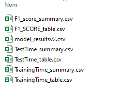

# Fraud-Detection: A Comparative Study: Ensemble Learning Techniques

This repository presents a detailed analysis of various ensemble learning techniques. The content within dives deep into the theoretical as well as practical implementations of these methods. 

**Please note that this study was conducted as part of my academic curriculum. It may not be exhaustive, and there could be potential errors or areas for improvement.**

## Abstract

In the realm of fraud detection, the quest for robust, efficient, and quick machine learning methods remains at the forefront. This research delves into a rigorous experimentation of various prediction models with the primary goal of discerning which method boasts the highest F1 score in fraud detection. Four preprocessed datasets, void of missing values, are employed. The distribution of these datasets is visualized using boxplots, highlighting the necessity of data normalization due to the presence of numerical variables. Through methodical cross-validation and GridSearch techniques for hyperparameter optimization, this study ensures that the selected models are both optimized and resilient. Notably, XGBoost Classifier emerged as the dominant model in terms of performance, offering the highest average F1 score across datasets. Simultaneously, Logistic Regression was the fastest to train, presenting a compelling case for real-time applications where training speed may be prioritized over peak performance. This study offers invaluable insights for those in the fraud detection domain, emphasizing the need to consider both model accuracy and efficiency.

## Main results of the study 

After rigorous testing on four preprocessed datasets, the XGBoost Classifier emerged as the superior model in terms of performance, showcasing the highest average F1 score across all datasets.


## Repository Contents

1. `EnsembleLearningProject.pdf`: The primary document containing an in-depth discussion, experimentations, visualizations, and results of this comparative study.
2. `EnsembleLearningProject.ipynb`: The Jupyter notebook used for the experiments and analyses.
3. `results/`: This folder contains datasets containing the results of our study.  
   

## Keywords

- Ensemble Learning
- Bagging
- Boosting
- Stacking
- Random Forest
- XGBoost
- Logistic Regression Penalized

## How to Run the Notebook

1. Ensure you have [Jupyter Notebook](https://jupyter.org/install) installed.
2. Clone this repository.
3. Navigate to the main folder and launch Jupyter Notebook.
4. Open the `EnsembleLearningProject.ipynb` notebook and run the cells to see the analyses and results. Training can take a lot of ressources.

## Packages Required

To successfully run the experiments and notebooks provided in this repository, the following packages are essential:

- `numpy`: For numerical operations and linear algebra.
- `pandas`: For data manipulation and analysis.
- `matplotlib`: For creating visualizations and plots.
- `scikit-learn` (often imported as `sklearn`): For machine learning and ensemble techniques.
- `xgboost`: For using XGBoost model
- `jupyter`: For running and viewing the `.ipynb` notebook files.

To install all the required packages, you can use the following pip command:

\```bash
pip install numpy pandas matplotlib scikit-learn scipy jupyter
\```

## Data link

Datasets used in this study are available here : [Github](https://github.com/marrvolo/SCDA)


## Cite

Babey, C. (2023). Ensemble Learning Techniques: A Comprehensive Study.

## Contact

For any inquiries or further discussion about this project:

- **GitHub**: Feel free to open an issue or send me a direct message here on GitHub.
- **LinkedIn**: Connect with me or send me a message on [LinkedIn](https://www.linkedin.com/in/cassienbabey/).

I appreciate feedback and collaboration, so please don't hesitate to reach out!

## License

This project is licensed under the MIT License - see the [LICENSE.md](LICENSE.md) file for details.
